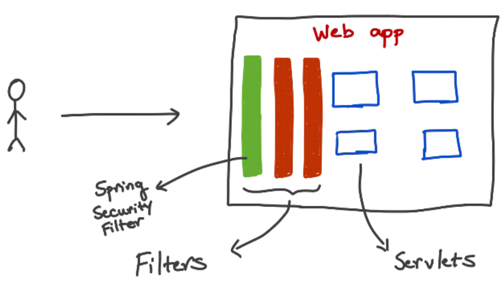
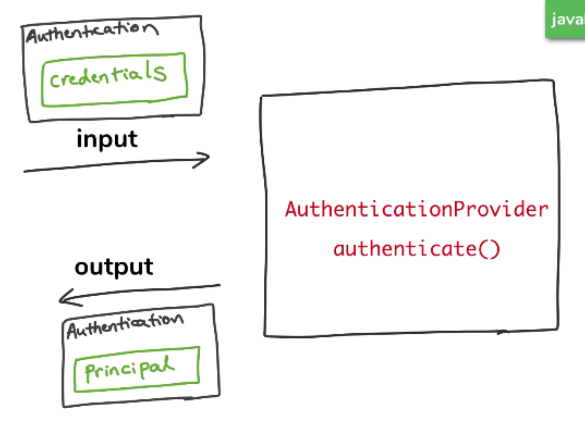

# Spring-Security-Intro

1. Configure Spring Security Authentication

    1. get hold of AuthenticationManagerBuilder
    2. set the Configuration on it

2. Configure Spring Security Authorization

    1. get hold of HttpSecurity
    2. set the Configuration on it

 

# How Spring Security Authentication works [@](https://www.marcobehler.com/guides/spring-security)

1. Spring Security Filter

    

2. AuthenticationProvider

    AuthenticationProvider takes instance of authentication with credentials & returns instance of authentication with principal 

    

3. AuthenticationManager

    AuthenticationManager holds list of AuthenticationProvider instances. What this actually does is iterate over all instances of AuthenticationProvider and tries to authenticate user with each one. The actual authentication is performed inside AuthenticationProvider.

    
 
    

4. UserDetailService

    The UserDetailsService interface is used to retrieve user-related data. It has one method named loadUserByUsername() which can be overridden to customize the process of finding the user. It is used by the DaoAuthenticationProvider to load details about the user during authentication

    

    

<i>
<b>AuthenticationManager</b> holds list of different <b>AuthenticationProvider</b> instances. It iterates over each instances of AuthenticationProvider and tries to authenticate user with each one. The actual authentication is performed inside <b>AuthenticationProvider</b>. Each AuthenticationProvider contains instance of <b>UserDetailsService</b> which is responsible for fetching user information (including hashed password) out of database for example, or LDAP. Once instance of UserDetails is successfully retrieved from database <b>AuthenticationProvider</b> will then use instance of <b>PasswordEncoder</b> to check whether password user provided matches hashed password you retrieved from database.
</i>