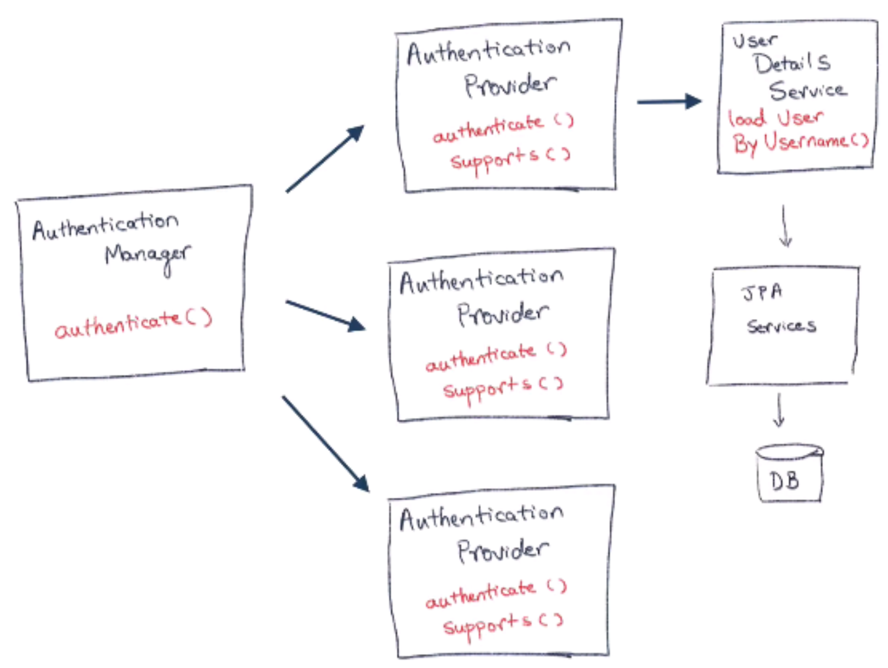

# Spring Security with JPA

Spring Security with JPA authentication using PostgreSQL database

<center></center>

---

## Postgresql Installation
***Installation***
```
$ sudo apt-get update
 
$ sudo apt install postgresql postgresql-contrib
```

***Use Default User-psql***
```
$ sudo -u postgres psql postgres
```


***Use New User***
```
$ sudo -u postgres psql postgres

postgres=# CREATE ROLE "Shiru99" WITH PASSWORD '1234';

postgres=# ALTER ROLE  "Shiru99" WITH LOGIN;
```

***Create New Database***
```
postgres=# CREATE DATABASE springsecurity;  (dbname - all letters small)

$ psql -U Shiru99 -h localhost -p 5432 -d springsecurity;
```

***Create New Table***
```
springsecurity=> CREATE TABLE users (
   id   INT     PRIMARY KEY     NOT NULL,
   username VARCHAR(50) UNIQUE NOT NULL,
   password VARCHAR(50) NOT NULL,
   roles VARCHAR(50),
   active BOOLEAN NOT NULL
);
```

***Insert New Table-entries***
```
springsecurity=> INSERT INTO users VALUES (1, 'John Doe' , '1234', 'ROLE_USER', false);
```

***List of Tables***
```
springsecurity=> \dt;
```

***Table-entries***
```
springsecurity=> select * from users;
```
---

### Port 8089 was already in use :

```
$ lsof -i :8089 | grep LISTEN
java    354291 shiru  102u  IPv6 240958      0t0  TCP *:8089 (LISTEN)
$ kill -9 354291
```